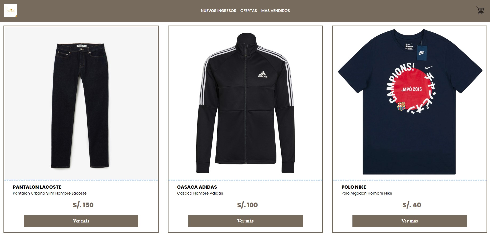

# Ronaldo-Proyecto-Reactjs

Este proyecto es una aplicación web creada con **React.js** y **Vite**. Es una plataforma interactiva diseñada para mostrar las capacidades de una página moderna, rápida y optimizada para el desarrollo.



## Características

- **Interactividad Dinámica**: Utiliza el poder de React para manejar el estado de los componentes.
- **Desarrollo Rápido con Vite**: Vite es utilizado para un flujo de trabajo de desarrollo más rápido, con recarga en caliente (Hot Module Replacement).
- **Estructura de Componentes**: Todos los elementos visuales están gestionados a través de componentes React.

## Tecnologías Usadas

- **React.js**: Biblioteca para la construcción de interfaces de usuario.
- **Vite**: Herramienta de construcción y desarrollo que proporciona un entorno de desarrollo rápido y optimizado.
- **CSS/SCSS**: Estilizado de componentes para mejorar la experiencia visual.
- **JavaScript**: Lenguaje de programación principal.

## Instalación

Sigue estos pasos para instalar y ejecutar el proyecto en tu máquina local:

1. **Clona el repositorio**:
   ```bash
   git clone https://github.com/Ronaldo14715/Ronaldo-Proyecto-Reactjs.git
2. **Navega al directorio del proyecto:**:
    cd Ronaldo-Proyecto-Reactjs
3. **Instala las dependencias necesarias con npm:**
    npm install
4. **Ejecuta el servidor de desarrollo:**
    npm run dev

## Estructura del Proyecto

- **`src/`**: Contiene todos los componentes y archivos principales de React.
  - `App.js`: Componente principal.
  - `components/`: Carpeta que contiene otros componentes reutilizables.
  - `assets/`: Imágenes, fuentes y otros recursos estáticos.
- **`public/`**: Archivos públicos como `index.html`.
- **`vite.config.js`**: Configuración de Vite.
- **`package.json`**: Archivo de configuración de dependencias y scripts.